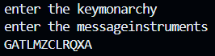

# Playfair Cipher Encryption

## Overview
This is an implementation of the Playfair Cipher, a classical encryption algorithm that encrypts digraphs (pairs of letters) instead of single letters. This script allows users to encrypt a message using a Playfair cipher with a given keyword.

## Features
- Constructs a 5x5 key table using a user-provided key.

- Handles the letter 'J' by replacing it with 'I' (as per traditional Playfair rules).

- Pairs letters for encryption, inserting 'X' when needed to avoid duplicate pairs.

- Encrypts the message using row, column, and rectangle rules.

## How It Works
The key table is constructed by removing duplicate letters from the given key and filling in the remaining spaces with the rest of the alphabet (excluding 'J').
The message is prepared by replacing 'J' with 'I' and ensuring each letter pair is distinct (adding 'X' if needed).
The encryption process applies the three Playfair rules:
- If both letters are in the same row, replace each letter with the one to its right (wrapping around if needed).
- If both letters are in the same column, replace each letter with the one below (wrapping around if needed).
- If neither rule applies, form a rectangle and swap letters accordingly.

## Usage
### Encryption
- Enter a key (a word or phrase used to generate the cipher table).
- Enter a message to encrypt.
- The script applies Playfair cipher rules and outputs the encrypted message.

## Output image



## How to Use the Code from GitHub

1) Clone the repository using:
```ssh
git clone https://github.com/yourusername/playfair-cipher.git
```
2) Navigate to the project directory:
```ssh
cd playfair-cipher
```
3) Run the script using Python:
```ssh
python playfair_cipher.py
```
4) Follow the prompts to enter a key and a message for encryption.

## Codespaces Link
You may use the following link to run this code in codespaces

https://animated-happiness-5ggxg95pw6gpf4vrx.github.dev/