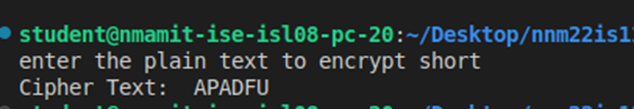

# Hill Cipher Encryption

## Overview
This is an implementation of the Hill Cipher, a classical encryption algorithm that encrypts plaintext using matrix multiplication. The cipher uses a key matrix to transform plaintext into ciphertext. The matrix dimension can be adjusted to handle different encryption sizes.

## Features
- Encrypts plaintext using a square key matrix.
- Handles padding of the plaintext to ensure its length is a multiple of the matrix size.
- Converts the plaintext into numerical format, applies matrix multiplication, and converts back to text.

## How It Works
The Hill Cipher works by converting each letter of the plaintext into a numerical equivalent (A=0, B=1, ..., Z=25). The plaintext is then grouped into vectors that correspond to the size of the key matrix. Matrix multiplication is applied to each vector, followed by a modulo 26 operation to generate the ciphertext. The key matrix is used to perform the transformation.
### Encryption Process
- Convert the plaintext into numbers based on the alphabet (A=0, B=1, ..., Z=25).
- Pad the plaintext if its length is not a multiple of the matrix dimension.
- Perform matrix multiplication with the key matrix.
- Convert the resulting numbers back to text to obtain the ciphertext.

## Usage
### Encryption
1) Enter the plaintext you want to encrypt.
2) A key matrix (of any size) is used to encrypt the plaintext.
3) The script encrypts the message and outputs the ciphertext.

## Output image


## How to Use the Code from GitHub
1) Clone the repository using:
```ssh
git clone https://github.com/yourusername/hill-cipher.git
```
2) Navigate to the project directory:
```ssh
cd hill-cipher
```
3) Run the script using Python:
```ssh
python hill_cipher.py
```
4) Follow the prompts to enter the plaintext for encryption.

## Codespaces Link
You may use the following link to run this code in codespaces

https://animated-happiness-5ggxg95pw6gpf4vrx.github.dev/


