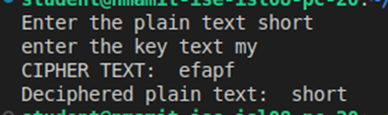

# Vigenère Cipher Encryption and Decryption
## Overview
This Python script implements the Vigenère Cipher, a classical encryption technique that uses a repeating keyword to shift letters in the plaintext. The script handles both encryption and decryption by converting the key into numeric shift values. Note that the input plaintext is converted to lowercase and spaces are removed before processing.

## Features
- Encryption: Shifts each letter of the plaintext forward using a numeric key derived from the given key string.
- Decryption: Reverses the encryption process by negating the key shifts.
- Automatically removes spaces from the plaintext to ensure a clean cipher.

## How It Works
### Encryption
- Preprocessing: The plaintext is converted to lowercase and all spaces are removed.
- Key Conversion: The key text is transformed into a list of numeric shift values by subtracting the ASCII value of 'a' from each character.
- Encryption Loop: For each letter in the plaintext, the corresponding shift value (cycling through the key) is added. The result is wrapped around modulo 26 to stay within the alphabet.
- Output: The encrypted text is generated in lowercase.
### Decryption
- Reverse Key: A decryption key is created by negating each numeric value of the original key.
- Decryption Process: The same Vigenère cipher function is used with the reversed key to shift letters back to their original positions.
- Result: The original plaintext (without spaces) is recovered.

## Running the Code
1) Clone the repository:
```ssh
git clone https://github.com/yourusername/vigenere-cipher.git
cd vigenere-cipher
```
2) Run the script:
```ssh
python vigenere_cipher.py
```
3) Follow the Prompts:
```ssh
Enter the plain text: Type your message (e.g., hello world).
Enter the key text: Provide the key (e.g., key).
```
4) Output: The script will display both the cipher text and the deciphered plain text.

## Example Interaction


## Link to Codespaces
https://animated-happiness-5ggxg95pw6gpf4vrx.github.dev/
