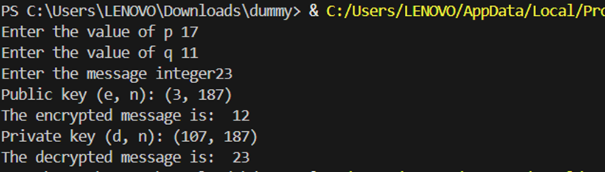

# RSA Encryption and Decryption in Python
## Overview
This repository contains an implementation of RSA (Rivest-Shamir-Adleman) encryption and decryption in Python. The script generates public and private keys, encrypts a message using modular exponentiation, and decrypts the ciphertext back to its original message.

## Features
✅ Generates Public and Private Keys based on two prime numbers.

✅ Encrypts a Message using modular exponentiation.

✅ Decrypts the Ciphertext back to the original message.

✅ Implements the Extended Euclidean Algorithm to find the modular inverse.

## How RSA Encryption Works
- Step 1: Choose Two Prime Numbers
The user inputs two prime numbers p and q.
Compute n = p × q (modulus for both keys).
Compute ϕ(n) = (p - 1) × (q - 1) (Euler’s totient function).
- Step 2: Choose Public Key (e)
The public exponent e is chosen such that gcd(e, ϕ(n)) = 1 (i.e., e and ϕ(n) are coprime).
The first valid value of e is selected from the range [2, ϕ(n)].
- Step 3: Compute Private Key (d)
The private key exponent d is the modular inverse of e under mod ϕ(n).
Calculated using the formula:
d ≡ e⁻¹ (mod ϕ(n))
This means d × e ≡ 1 (mod ϕ(n)).
- Step 4: Encryption
Convert the message m into an integer.
Compute ciphertext C using modular exponentiation:
e=pow(C,phi,n)
- Step 5: Decryption
Compute the original message M from ciphertext C using:
C=pow(C,phi,n)  #pow(Base, Exponent, Mod)

## Example fix

##Link to COdespaces:
https://animated-happiness-5ggxg95pw6gpf4vrx.github.dev/
